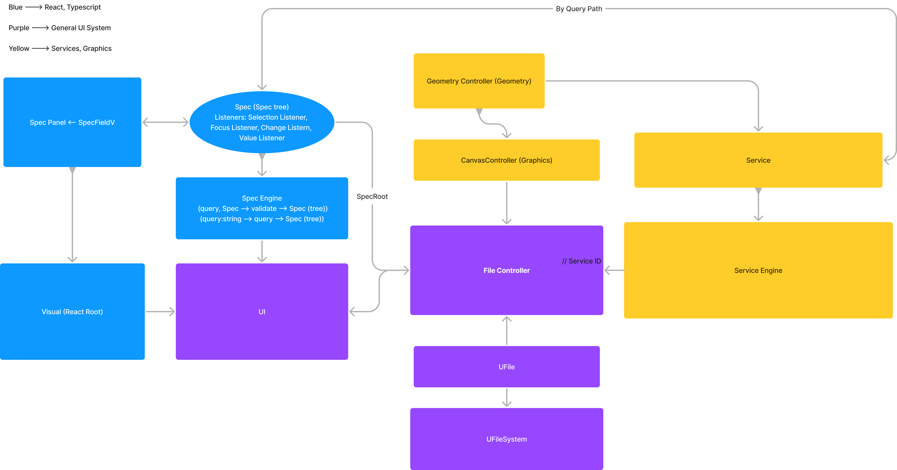

# PolyFEM UI
PolyFEM UI is now migrated to Yarn for hot reloading during development. This project is bootstrapped with [Create React App](https://github.com/facebook/create-react-app).


## Available Scripts

In the project directory, you can run:

### `yarn start`

Runs the app in the development mode.\
Open [http://localhost:3000](http://localhost:3000) to view it in the browser.

The page will reload if you make edits.\
You will also see any lint errors in the console.

### `yarn test`

Launches the test runner in the interactive watch mode.\
See the section about [running tests](https://facebook.github.io/create-react-app/docs/running-tests) for more information.

### `yarn build`

Builds the app for production to the `build` folder.\
It correctly bundles React in production mode and optimizes the build for the best performance.

The build is minified and the filenames include the hashes.\
Your app is ready to be deployed!

See the section about [deployment](https://facebook.github.io/create-react-app/docs/deployment) for more information.

### `yarn eject`

**Note: this is a one-way operation. Once you `eject`, you can’t go back!**

If you aren’t satisfied with the build tool and configuration choices, you can `eject` at any time. This command will remove the single build dependency from your project.

Instead, it will copy all the configuration files and the transitive dependencies (webpack, Babel, ESLint, etc) right into your project so you have full control over them. All of the commands except `eject` will still work, but they will point to the copied scripts so you can tweak them. At this point you’re on your own.

You don’t have to ever use `eject`. The curated feature set is suitable for small and middle deployments, and you shouldn’t feel obligated to use this feature. However we understand that this tool wouldn’t be useful if you couldn’t customize it when you are ready for it.


## Entry Points
**_For coding convenience, all related modules should hold reference to the main UI instance.
All individual visual/logical components should hold references to the file that they are
managing by referencing a FileHandle and its unique fileId (if applicable)._**

_src/js/main.ts:_

The central entry of the entire program. Hosts the main instance of the UI. The main
instance holds reference to all under modules, and is instantiated under the class `UI`.

```typescript
class UI{
    //...
}
```

_src/visual.ts:_

This newly created module will serve to handle all the visual layouts of the UI. Learning
from previous lessons, this time the UI will only have a single `root div` as the React anchor.
So every visual layout changes can be made by directly modifying the contents of `visual.ts`.

```typescript
class Visual extends React.Component<any, any>{
    //... Being a Component itself respects the design intention of 
    // closed control of a React based UI.
}
```

_src/components/*_

This is the folder where all our other individual React components reside in.

_src/graphics.ts_

For the lack of a better name, this module will contain the graphical editor for visually
interacting with geometrical configurations for PolyFEM or other computational libraries.
This time Three.js would be used instead of Babylon, due to cleaner visuals and interactions
of Three.js, as well as its well-structured library for tooling supports (there were too much
niche tricks that had to be invented for doing customized things with Babylon).

```typescript
//Graphical Editor
class GEditor{
    //Viewing or editing?
    editing: boolean;
    //...
}
```

_src/server.ts:_

Connects to the localhost server through the abstraction of a `FileSystem` interface.
```typescript
class UFileSystem{
    //Mounts the file system on top of the rootURL
    constructor(rootURL: string){
        //...
    }

    /**
     * Returns the root file,
     * which has the rootURL as its local location
     */
    getRoot(): UFile{
        return this.fileRoot;
    }
}

class UFile{
    //Abstraction of file reading/writing & directory access
}
```

_src/fileControl.ts:_

For expediting visual/contextual handling of individual files. The main module is the class `FileControl`, which maybe extended to
handle of different file types.

In particular, `JSONFileControl` which extends `FileControl`, provides
support for managing `.json` specs, by abstracting file edits through interface `GeometricOperation`, and hosting the redo/undo
stacks of these operations.
```typescript
class FileControl{
    fileName: string;
    fileReference: UFile;
    fileDisplay: HTMLElement;
    alternativeDisplay: HTMLElement;
}

class JSONFileControl extends FileControl {
    //...Supports control of a .json geometrical representation
}

/**
 * Provides the basic structure of a geometric operation
 * for storage purpose
 */
class GeometricOperation{
    geometryID: string;
    operation: string;
    parameters: number[];

    constructor(geometryID: string) {
        this.geometryID = geometryID
    }
}
```

### server/*
The local REST server is built in Node.js and technically is independent from the structural hierarchy of the entire Front End
(which is everything above). So its folder should be separated from the 'src/' source folder.

GET _/mesh-convert/:orgFileURL/:targetFileName:_

Converts a file at the `orgFileURL` to an accessible format, such as .obj, and returns it with the `targetFileName`.
This route is the only non-stateless method in the server as it caches the converted results at the `orgFileURL` inside
the server/temp folder. When accessing files at the orgFileURL, its last modified-date is compared with the timestamp of the
cached file. This will greatly speed up the file access time, and appear as if the files are converted at the
time of accessing to simulate REST.
```typescript
var stats = fs.statSync(orgFileURL);
var mtime = stats.mtime;
console.log(mtime);
```

## Architectural Diagram


## Debugging
~~* `npm` commands now needs to be run with `--force` due to unknown versioning issues in React.~~

## Learn More

You can learn more in the [Create React App documentation](https://facebook.github.io/create-react-app/docs/getting-started).

To learn React, check out the [React documentation](https://reactjs.org/).
