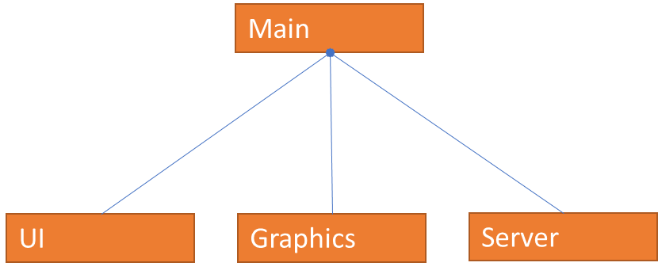

# Documentation

## Project setup
### Node
``npm init``r
Prompts the project setup procedures, and creates package.json.

Reference: https://docs.npmjs.com/cli/v7/commands/npm-init

### Typescript
Standard language of the project for modular development

Reference: https://robertcooper.me/post/get-started-with-typescript-in-2019

`npm install --save-dev typescript` local installation

### Compilation
To ensure simplicity of the development environment, I will experiment with using only the typescript transpiler in the development phase
and do away with Grunt. Create a tsconfig.json file with `tsc --init`.

`tsc` for one-time transpiling

`tsc -p` for automated transpiling

### Source Mapping
Typescript provides the functionality for source mapping as an option in ts-config.json. A thorough introduction to the options for
typescript source mapping provided here: https://www.carlrippon.com/emitting-typescript-source-maps/. Why do we want to use source maps?
That's because after transpilation and building, the code will become scrambled and unclear. In order to debug from this clutter,
a mapping from the generated files back to the original files must be created. With the help of source mapping, browsers like Chrome will
display the original code in the developer console and developers can directly set breakpoints or see error references to the original code.
More details on: https://trackjs.com/blog/debugging-with-sourcemaps/.

### Module
- In order to resolve a reference issue in the transpiled code of helloworld.ts, the commonjs npm module is added.

- The solution doesn't really work, the commonjs module is kept since why not.

- As noted through many trials, typescript faces immense trouble when directly producing browser compatible code. In particular, the output
  of typescript transpilation is optimized for commonjs, a format that presumes the nodejs environment with keywords such as require built in.
  The transpilation does not compile into the resultant files any source codes from relevant modules such as three.js, but simply presumes
  the usefulness of 'require' magic. In order to resolve this problem with module loading, and potentially many future issues, the transpiled code
  provided by typescript need further transformations such as browserify to become browser compatible. After some digging, a good pipeline that
  streamlines this whole process of multiple transformations is to be found at: https://gist.github.com/michalochman/d64360541a484e16817c.
  The pipeline is based on gulpfile, which in my opinion is better than nothing.

#### Gulp
Again, in order to resolve the module building issue with typescript, this time gulpfile is used for the building task. Installation for Gulp is to be found
at https://gulpjs.com/docs/en/getting-started/quick-start. One also need to install all the modules required by https://gist.github.com/michalochman/d64360541a484e16817c
for the gulpbuild.js in the directory to run correctly.
- Multiple error persisted with the use of Gulp, it turned out that 'three/src/three.js' is using import and export statements that aren't in the
  common js standard, but 'three/build/three.js' is. Gulp was not the key to the solution. After changing the import directory in helloworld.ts from
  'three/src/three.js' to just 'three', the issue was resolved without the help of Gulp.

#### Final working solution
- Import 'three' in the ts scripts, use `tsc` for transpilation from ts to commonjs, use
  `browserify DIR/SOURCE -o DIR/OUT` to transform the commonjs code to browser compatible ones.

- Next I would like to try automate this process with something like grunt, and find out how to build source maps

### Gulp again
- Now that a working solution has been established, I would like to add in the function of automation, which after some research, advocates for the use
  of Gulp over Grunt: https://www.keycdn.com/blog/gulp-vs-grunt. So Gulp again, but this time not to resolve an ongoing issue, but to help
  improve the development flow with its power in automating processes. This article comes handy in getting us started with Gulp https://www.typescriptlang.org/docs/handbook/gulp.html.
- To understand how files get passed around and processed in gulpbuild.js, one shall read https://gulpjs.com/docs/en/getting-started/working-with-files/.
  Gulp makes extensive use of Node streams. To understand how Node streams work on an interface level, which can be helpful in future developments in user
  collaboration functionalities, check https://nodesource.com/blog/understanding-streams-in-nodejs/ (super clear & interesting by the way).
- A gulpbuild.js needs to be added, which should contain all the streamlined methods provided by gulp modules for the file processing facilitated by Node streams. The current
  stream is tsc and then browserify the generated .js files.

### Browserify
The browserify module on itself can also perform typescript transpilation with the help of a plugin called tsify (https://www.npmjs.com/package/tsify).
This is the method for integration with Gulp that was
officially adopted by typescript. tsify reads from the tsconfig.json with a few exceptions, the behaviors of which are described in the link above. One
important exception is that when the debug option for browserify() is set to true the source map for the entire process, including
transpiling into javascript and bundling the modules, gets generated regardless of what has been specified in the tsconfig.json. The generated
file content can then converted into vinyl format using source, a gulp module placed in the pipeline.

### Source mapping with Gulp and Browserify
Gulp provides build in functionality for source mapping with the module gulp-sourcemaps. Aside from supporting source map generations for official plugins,
it also supports loading existing source maps from vinyl up streams. The specifications are here: https://www.npmjs.com/package/gulp-sourcemaps. On the page
https://www.typescriptlang.org/docs/handbook/gulp.html, the complete use case of typescript->javascript->browserify using gulp with sourcemap is also provided.

### Watching
Monitoring the changes made to the typescript programs in src directory and updating the corresponding transpiled programs in the dist directory can be extremely
helpful in the process of debugging. Since only the transpiled javascript program organized in the dist folder can be run and tested in a browser, building them in real
time streamlines the workflow. One gets to test changes made to the program without having to actively recompile by simply refreshing the browser, while the building
process becomes largely invisible to programmers.

## Client Side
The development of PolyFEM-UI is split into two parallel parts. The client side takes care of the primary level of
user interactions, inputs and outputs, the server side takes care of the direct communication with local PolyFem libraries.

The client side architecture is as follows:

Main provides a centralized entry for all the functionalities of the client-side. It hosts the main thread
of clientside, and from the main module one is able to issue all commands that control the client side. 

Plugged into Main via composition are the three root level modules that oversee functions of the client side.
### UI
UI is the entry to anything visual on screen. Its entry point will be `ui.tsx`, the typescript supported version
of `jsx`. It will be written mostly following react state conventions. There will also be helper methods added 
to streamline and encapsulate the UI controls and feedbacks into a single object instance.

#### Tab Panel
Tab panel is located in the center of the UI, and allows users to switch between displays and files of 
PolyFEM. It is by itself a React element, and it will contain non-React elements such as Babylon canvas that main
will inject. To allow the containment of non-React elements, the component will be prevented from updating once rendered.
See practiced standard: [integrating with other libraries](https://reactjs.org/docs/integrating-with-other-libraries.html). 
Or if necessary, references to the underlying tabs will be separately kept, and injected with JQuery after each update using component did mount.

### Graphics
Graphics is the modular entry to all visualizations. It will provide a modularized interface to the Babylon supports.
It's supposed to organize the general visualization tasks of PolyFEM-UI into a single instance.
### Server
The purpose of the Server module is to provide a communication channel to the server side. However, it will not directly provide
methods for communication through the server, but rather act as an abstraction of the entire server side. The communication
process, such as http I/O, synchronization, and Error handling, will be taken care of internally within the server module.
To Main, the serverside, namely the entire PolyFEM library, should appear as if it is available locally on the client side.

## Server Side
We use nodejs to support the launching and maintenance of the server. Nodejs provides support for local http-server
through the express module. The communication between the client side and server side are maintained by rest protocols,
which are immediately implemented by nodejs express. 

The current functionalities of server side comprises a T2C pipeline, a client side listener, and a communication module 
for exchanging commands with the local PolyFEM library. We will implement these functionalities directly as a single module.
As the complexity of the tasks handled by Serverside grows, we may modify the design into a modular architecture.